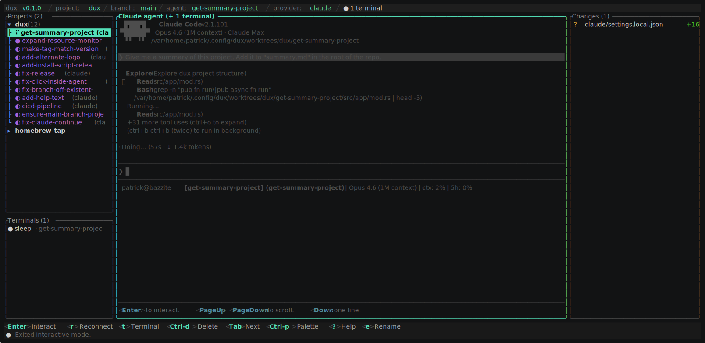

# dux


Your AI agents deserve a proper office. **dux** (pronounced "dooks") is a terminal UI that lets you run multiple AI coding agents side by side, each in its own git worktree, with full companion terminals, macros, commit generation, and a command palette that knows more tricks than you do.

No protocol layers. No adapters. No JSON-RPC. Just real CLIs running in real terminals.

Oh, and it's fast and consumes low resources: more RAM is left for Claude, Codex or any of the other agents 👍

[](https://asciinema.org/a/IvqL89rXvwCzvSxQ)

## Why dux?

Most AI coding tools give you one agent in one directory. dux gives you **unlimited agents across unlimited worktrees**, all visible at once. Spawn five agents on five branches and let them work in parallel. Fork a session to try a different approach without losing the original. Open companion terminals next to your agents for builds, tests, or just poking around.

Every agent runs through a PTY, the same pseudo-terminal your shell uses. That means the CLI tool (Claude, Codex, Gemini, OpenCode, or literally anything else) runs exactly like it would in your regular terminal. Your MCP servers, hooks, skills, slash commands, and permission dialogs all work. We don't mess with your setup.

## Install

**Homebrew:**

```bash
brew install patrickdappollonio/tap/dux
```

**Shell:**

```bash
curl -sSfL https://github.com/patrickdappollonio/dux/releases/latest/download/install.sh | bash
```

By default, the script installs to `~/.local/bin` if it exists and is in your `PATH`, otherwise `/usr/local/bin`. You can override the install directory or pin a specific version:

```bash
# Custom install directory
curl -sSfL https://github.com/patrickdappollonio/dux/releases/latest/download/install.sh | DUX_INSTALL_DIR=~/.bin bash

# Specific version
curl -sSfL https://github.com/patrickdappollonio/dux/releases/latest/download/install.sh | DUX_VERSION=v0.1.0 bash
```

**Binary download:**

Grab the latest release for your platform from the [Releases](https://github.com/patrickdappollonio/dux/releases) page. Extract it, drop the `dux` binary somewhere on your `PATH`, and run it. On first launch, dux creates a fully commented config file. That file *is* the documentation.

## Prerequisites

- **`git`** — dux is built around git worktrees, so git is non-negotiable. If it's not on your PATH, dux won't get very far.
- **`gh` CLI** *(optional)* — authenticate it with your GitHub account and dux can pull PR statuses, check details, and show them right in the interface. Not required, but you'll miss it once you've tried it.

## How It Works

dux organizes work around **projects** (git repos) and **agents** (worktree sessions). When you create an agent, dux branches off a new git worktree so the agent has its own isolated copy of the code. No conflicts with your main checkout, no stepping on other agents' changes.

The interface has three panes:

- **Left:** your projects and agent sessions
- **Center:** the agent's live terminal output (or a file diff)
- **Right:** changed files, staging, and diffs

Tab between panes. Resize them with keyboard or mouse. Collapse the sidebar or git pane when you want more room. Go fullscreen with interactive mode. It's your layout.

### Bring Any CLI

Any terminal command can be a provider. The four defaults (Claude, Codex, Gemini, and OpenCode) are pre-configured, but adding your own is a config-only change:

```toml
[providers.my-agent]
command = "my-cool-agent"
args = ["--some-flag"]
resume_args = ["--continue"]
```

Set `resume_args` and dux can reconnect to detached or crashed sessions. Omit it if your CLI doesn't support resuming; dux will just relaunch it.

Switch providers from the command palette. dux sticks to one agent per worktree, so provider changes happen in place:

- **`change-agent-provider`** swaps the *selected* worktree's provider on next launch. If the agent is still running, dux records your choice and warns you — the running agent keeps going until you exit and relaunch it, at which point it spawns with the new provider. If you've used that provider on this worktree before, dux passes its `resume_args` so you pick up the previous conversation instead of starting fresh.
- **`change-default-provider`** picks which provider *new* agent sessions should spawn with. Existing agents keep their current provider; to move a running one, use `change-agent-provider` after stopping it.

The header shows `default provider: …` for the project and adds `current provider: …` when the selected agent is using a different one, so you always know which CLI you're talking to.

You can also set a default per-project in the config file, which wins over the global default for that one project.

### Macros

Tired of typing the same prompt over and over? Turn it into a macro. Macros are reusable text snippets you trigger from a quick-select bar. Search by name, hit enter, and the text gets sent to the active pane.

```toml
[macros]
"Review" = { text = "review this code for bugs and security issues", surface = "agent" }
"Build" = { text = "cargo build --release 2>&1", surface = "terminal" }
"Ship it" = { text = "run all tests, fix failures, then commit", surface = "agent" }
```

Each macro can be scoped to the agent pane, the companion terminal, or both.

### Git Integration

The right pane is a full git staging area. Stage and unstage files, view syntax-highlighted diffs, write commit messages, push, and pull, all without leaving dux.

**AI commit messages:** Stage your changes, hit a key, and dux sends the diff to your provider in oneshot mode. It drafts a commit message using Conventional Commits, you tweak it (or don't), and commit. The prompt is fully customizable per-project.

**PR tracking:** With the `gh` CLI installed, dux tracks pull requests for your agent branches and shows status pills right in the interface.

### Companion Terminals

Each agent gets its own companion terminal: a separate shell session in the same worktree. Use it for builds, tests, git operations, or anything else you'd normally do in a terminal. You can spawn multiple companion terminals per agent.

### Forking Sessions

See an agent going down the wrong path? Fork it. dux creates a new worktree with the current files copied over so you can try a different approach without losing the original session. It's branching, but for your AI conversations.

### Command Palette

Press the palette key and you get fuzzy-searchable access to every action in dux, including features that don't have dedicated keybindings. Sort agents, toggle UI elements, open the resource monitor, rename sessions, edit macros, and more. If you forget a keybinding, just open the palette.

### Configuration

The config file at `~/.config/dux/config.toml` (Linux) or `~/.dux/config.toml` (macOS) is exhaustively commented. Every setting is explained inline, so you should never need to leave the file to understand an option. Every keybinding is rebindable. Every pane width, scrollback limit, and default provider is configurable.

```bash
dux config path          # Print the config file path
dux config diff          # Show what you've changed from defaults
dux config diff --raw    # Unified diff against the default config
dux config reset         # Remove config and logs (keeps agents)
dux config reset --all   # Full factory reset
dux config regenerate    # Preview a fresh default config
```

Override the config directory with the `DUX_HOME` environment variable.

### Themes

dux writes `config.toml` the first time it launches, so theme setup starts from a real, editable file instead of a guessing game. The generated config includes `[ui].theme = "dux_dark"`, plus comments with built-in theme examples. Edit that value, or use the `change-theme` command from the palette to preview and save a theme from inside the app.

Custom themes live next to the config file:

```text
~/.config/dux/themes/my_theme.toml  # Linux
~/.dux/themes/my_theme.toml         # macOS
```

Then set:

```toml
[ui]
theme = "my_theme"
```

Theme names resolve in this order: your `themes/<name>.toml` file wins first, then the bundled `dux_dark`, then built-in [Opaline](https://github.com/hyperb1iss/opaline) themes such as `catppuccin_mocha`, `nord`, `dracula`, `gruvbox_dark`, `tokyo_night`, `solarized_dark`, `one_dark`, and `rose_pine`. If the name cannot be loaded, dux falls back to `dux_dark` and writes a warning to the log.

Themes use the [Opaline](https://github.com/hyperb1iss/opaline) TOML format. A small theme only needs semantic tokens; dux derives its app-specific `dux.*` colors from those so you do not have to define every button, gutter, and diff color by hand:

```toml
[meta]
name = "cyber_peacock"
author = "you"
variant = "dark"
description = "A vivid dark theme for dux."

[palette]
base = "#101018"
panel = "#171725"
highlight = "#24243a"
active = "#303050"
text = "#f4f7ff"
muted = "#aab2d5"
dim = "#6f7899"
accent = "#00d4ff"
accent_secondary = "#ff4fd8"
border = "#5b6ee1"
success = "#4ade80"
error = "#fb7185"
warning = "#facc15"
info = "#38bdf8"

[tokens]
"text.primary" = "text"
"text.muted" = "muted"
"text.dim" = "dim"
"bg.base" = "base"
"bg.panel" = "panel"
"bg.highlight" = "highlight"
"bg.active" = "active"
"accent.primary" = "accent"
"accent.secondary" = "accent_secondary"
"border.focused" = "border"
"border.unfocused" = "dim"
success = "success"
error = "error"
warning = "warning"
info = "info"
```

Want full control? Add explicit `dux.*` tokens. The bundled `assets/themes/dux_dark.toml` is the complete reference, including header chrome, overlays, hints, diffs, help, inputs, and PR colors. PR state colors intentionally default to GitHub-style green, purple, and red so merged, open, and closed states stay recognizable, but you can override `dux.pr_*` tokens too.

### Keybindings

All keybindings live in the `[keys]` section of the config. Key format supports single characters (`"j"`), special names (`"enter"`, `"pageup"`, `"shift-tab"`), and modifier combos (`"ctrl-d"`, `"ctrl-p"`). Each action takes an array of key combos:

```toml
[keys]
quit = ["ctrl-q"]
open_palette = ["ctrl-k"]
```

Press `?` in the app for the full keybinding reference. The help overlay is the authoritative source. This README intentionally doesn't list individual bindings because they're yours to change.

### Logging

Logs go to `dux.log` in the config directory. Control the level in your config:

```toml
[logging]
level = "info"   # "error", "info", or "debug"
path = "dux.log" # relative to config dir, or use an absolute path
```

Records are emitted as **JSON Lines** (one structured object per line) by the
`tracing` subscriber. Every record carries a `target` such as `dux::workers`,
`dux::pty`, or `dux::sessions`, plus structured fields (`session_id`,
`agent`, `err`, …) so log post-processing — GDPR purge filters, the doctor
tool, simple `jq` greps — works without parsing free-form text. Operator-facing
strings (git stderr, branch names, PR titles, process names) are sanitized to
strip ANSI/OSC/DCS sequences before they hit the log, so `tail dux.log` is
safe even when an upstream emitted hostile bytes.

The log file rotates daily; older days are kept in place next to `dux.log`
(`dux.log.YYYY-MM-DD`) so you can compress or ship them with normal log
tooling.

### Resource limits

dux ships with conservative defaults for the resources a single host should
spend on agent panes. Adjust them in `config.toml`:

```toml
[limits]
max_panes = 16                # hard cap on simultaneously-active panes
max_companion_terminals = 4   # cap on companion (raw shell) terminals
max_total_scrollback_mb = 256 # soft cap on scrollback grid memory
disk_high_water_pct = 95      # refuse new agents above this disk usage
disk_warn_pct = 80            # status-line warning above this disk usage
enable_scrollback_overflow_autodetach = false
```

`create_agent` consults these caps and refuses with a status-line error when
exceeded. The disk watchdog samples free space and bands the status line
yellow at `disk_warn_pct`, red (refuse new agents) at `disk_high_water_pct`.

### Auto-resume tuning

When `defaults.auto_resume_on_start = true`, dux re-spawns persisted
sessions on launch. To avoid a thundering herd on spot-VM reboot, the
resume scheduler is bounded:

```toml
[auto_resume]
concurrency = 4   # max parallel PTY spawns
stale_days = 30   # skip sessions whose worktree mtime is older than this
stagger_ms = 250  # delay between successive spawn attempts
```

### Session DB durability

`sessions.sqlite3` opens with `PRAGMA journal_mode=WAL` and
`PRAGMA synchronous=NORMAL` so a spot-VM preemption mid-write no longer
corrupts the database. `PRAGMA integrity_check` runs once per launch, and a
periodic `.backup` is taken to `sessions.sqlite3.bak`. Tune the cadence:

```toml
[storage]
backup_interval_minutes = 30  # 0 disables periodic backups
```

### Diagnostics

`dux doctor` prints a single triage dump that operators can attach to a
support thread:

```bash
dux doctor              # human-readable
dux doctor --json       # machine-parseable
dux doctor --anonymize  # redact $HOME, branches, agent IDs
```

The dump covers `sessions.sqlite3` integrity and counts plus, when the
`dux-amq` overlay is installed, the AMQ binary integrity hash, queue depth,
oldest message age, kernel `dev.tty.legacy_tiocsti` value, encryption
posture of `$STATE_ROOT`, and recent auto-resume/purge counters. It is
read-only and safe to run while the TUI is open.

### Data lifecycle

dux stores per-session data in several places: the worktree on disk, a row in `sessions.sqlite3`, the AMQ inbox (`/data/state/amq/agents/<branch>/`), the per-provider chat history (`/data/state/{claude,codex,gemini}/projects/<encoded>/`), and structured log records tagged with the session's `session_id`. Most workflows leave that data in place — `dux config reset --all` is a holistic factory reset, but it does not target an individual session.

For GDPR Art 17 right-to-erasure (or just "delete this customer's data"), use `dux session purge`:

```bash
# Preview the cascade — nothing is changed.
dux session purge --hard <branch-or-id> --dry-run

# Real run. Asks for the confirmation phrase 'PURGE <branch>'.
dux session purge --hard <branch-or-id>

# Skip the prompt (e.g. from a script).
dux session purge --hard <branch-or-id> --yes

# Bulk: erase every session.
dux session purge-all --dry-run
dux session purge-all --yes
```

The cascade runs in a fixed order — worktree → provider chat dirs → AMQ inbox → log redact → sqlite row — so a crash mid-purge leaves a recoverable record in `sessions.sqlite3` and the operator can re-run the same command. Log records are not deleted; their `fields` object is replaced with `{"redacted": true}` so the audit trail (this session was purged on this date) survives without the content.
