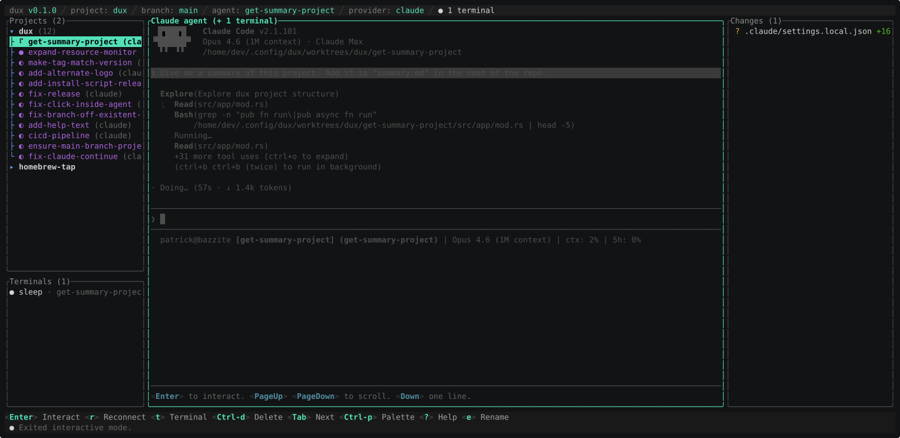

# dux

[](https://github.com/patrickdappollonio/dux/releases/latest) [](https://www.npmjs.com/package/@patrickdappollonio/dux)  [](https://buttondown.com/getduxapp)


Your AI agents deserve a proper office. **dux** (pronounced "dooks") runs multiple AI coding agents side by side, each in its own git worktree (or, for a standalone agent, in a folder you already have), with companion terminals, provider tabs, macros, and a full git staging area. Drive it from a terminal, or run `dux server` and drive the same workspace from a browser, phone included.

No protocol layers. No adapters. No JSON-RPC. Just real CLIs running in real terminals.

Oh, and it's fast and consumes low resources: more RAM is left for Claude, Codex or any of the other agents 👍

[](https://asciinema.org/a/IvqL89rXvwCzvSxQ)

## Why dux?

Most AI coding tools give you one agent in one directory. dux gives you **unlimited agents across unlimited worktrees**, all visible at once. Spawn five agents on five branches and let them work in parallel. Fork a session to try a different approach without losing the original. Run several provider tabs inside a single agent to point, say, Claude and Codex at the very same checkout at once. Open companion terminals next to your agents for builds, tests, or just poking around.

Every agent runs through a PTY, the same pseudo-terminal your shell uses. That means the CLI tool (Claude, Codex, Copilot, OpenCode, or literally anything else) runs exactly like it would in your regular terminal. Your MCP servers, hooks, skills, slash commands, and permission dialogs all work. We don't mess with your setup.

## Two Front Ends, One Engine

dux has two front ends over one engine: a terminal UI and a web UI. Both are first class, and both are staying. They share the same projects, the same agents, the same worktrees and the same config file, so an agent you start in one is the same agent in the other.

They are not identical, on purpose. Each surface does what its medium is good at. The terminal gives you full keyboard control, rebindable keys, a command palette that knows more tricks than you do, and themes. The browser gives you reach: any device on your network, including a phone, plus editing files in the page and desktop notifications. Where a capability only makes sense on one side, it lives on one side, and the page that covers it says why.

You won't find a per-feature comparison table here, because a table like that is stale the week after it's written. The app is the reference: in the terminal, the help overlay and the command palette; in the browser, the cog menu and the row `⋯` menus.

One thing worth knowing before you point a browser at anything: **there is no login.** No password, no token, no user accounts. dux is single-tenant by design, so everyone who can reach the address shares one workspace and can drive any agent, browse the server's filesystem, and edit your files. Loopback (the default), your own tailnet, or a reverse proxy you authenticate yourself are the safe shapes. A public address is not one. [Server Mode](#server-mode) has the details.

## Install

**Homebrew (macOS and Linux):**

On macOS, Homebrew is the preferred route. This command taps the source and installs dux in one shot, because life's too short for a two-command install:

```bash
brew install patrickdappollonio/tap/dux
```

**npm:**

Install dux globally so the CLI lands on your `PATH`. Installing it as a dependency of some random project technically works, but that's not where terminal apps go to be useful:

```bash
npm install -g @patrickdappollonio/dux
dux
```

For a one-off run without keeping it around:

```bash
npx -y @patrickdappollonio/dux
```

**Shell (all platforms):**

The install script sniffs out your operating system and architecture, then grabs the matching release archive. No guessing which tarball has your name on it:

```bash
curl -sSfL https://github.com/patrickdappollonio/dux/releases/latest/download/install.sh | bash
```

By default, the script installs to `~/.local/bin` if it exists and is in your `PATH`, otherwise `/usr/local/bin`. You can override the install directory or pin a specific version:

```bash
# Custom install directory
curl -sSfL https://github.com/patrickdappollonio/dux/releases/latest/download/install.sh | DUX_INSTALL_DIR=~/.bin bash

# Specific version
curl -sSfL https://github.com/patrickdappollonio/dux/releases/latest/download/install.sh | DUX_VERSION=v0.1.0 bash
```

The script checks the downloaded archive against the SHA-256 checksum published beside it and refuses to install anything if the two disagree. Releases published before checksums existed do not have one, and the script says so loudly and carries on. If the checksum cannot be *fetched* at all (no DNS, a refused connection, a TLS or proxy error) it says that instead, because a network problem on your machine is a different thing from a release without a checksum.

**Binary download:**

Grab the latest release for your platform from the [Releases](https://github.com/patrickdappollonio/dux/releases) page. Extract it, drop the `dux` binary somewhere on your `PATH`, and run it. On first launch, dux creates a fully commented config file. That file *is* the documentation.

Every release also carries a `<archive>.sha256` next to each archive and a combined `dux-checksums.txt`, both in the format `sha256sum -c` (and macOS's `shasum -a 256 -c`) reads directly.

You downloaded one archive, so check it against its own file:

```bash
# Next to the archive you downloaded
curl -sSfLO https://github.com/patrickdappollonio/dux/releases/latest/download/dux-linux-amd64.tar.gz.sha256
sha256sum -c dux-linux-amd64.tar.gz.sha256
```

`dux-checksums.txt` is the combined list of all four platforms. It is there for anyone mirroring or auditing a whole release, and `sha256sum -c` on it fails unless every one of the four archives is present in the directory:

```bash
# From a directory holding ALL four archives
sha256sum -c dux-checksums.txt
```

Worth being straight about what that buys you: it catches a corrupt or truncated download, and it gives you a value you can compare out of band. It is not tamper protection. The checksums are unsigned and served from the same place as the archives, so anyone able to replace an archive could replace its checksum too. Signing would be the answer to that, and dux does not sign releases yet.

## Prerequisites

- **`git`** — dux is built around git worktrees, so git is non-negotiable. If it's not on your PATH, dux won't get very far.
- **`gh` CLI** *(optional)* — authenticate it with your GitHub account and dux can pull PR statuses, check details, and show them right in the interface. Not required, but you'll miss it once you've tried it.

Building from source instead? `cargo build` is the whole story, though it also builds the React web UI (which is compiled into the binary), so you'll want Node 22+ on your PATH. [`CONTRIBUTING.md`](CONTRIBUTING.md) has the details, including how to skip the web UI build if you only care about the Rust side.

## How It Works

dux organizes work around **projects** (git repos) and **agents** (worktree sessions). When you create an agent, dux branches off a new git worktree so the agent has its own isolated copy of the code. No conflicts with your main checkout, no stepping on other agents' changes.

You can also point an agent at a folder you already have, with no project, no branch and no worktree of dux's: a **standalone agent**. dux runs the provider there and never creates, moves or removes that folder. The branch-identity features (push, pull, fork, pull requests) do not exist for one, and the changes panel follows the folder: you get a real one when the folder is itself a git repository.

Already have a Git worktree you want dux to use? The `new-agent-from-worktree` command in the palette lets you pick a project from the chooser and then choose from its existing worktrees. If the worktree is already managed by dux, dux reuses it and reconnects like a continuable session; if it's outside dux's managed worktree directory, dux copies it into a fresh managed worktree first so the original checkout is left alone.

In the terminal UI, the interface has three panes:

- **Left:** a flat list of your agents, most-active first, with search and a project chooser
- **Center:** the agent's live terminal (or a file diff). Focus it and type: your keystrokes go straight to the agent, right there in the window, while dux's own shortcuts keep working around it
- **Right:** changed files, staging, and diffs

Tab between panes. Resize them with keyboard or mouse. Collapse the sidebar or git pane when you want more room. Toggle the agent fullscreen when you want every key and every cell to belong to it. It's your layout.

### Bring Any CLI

Any terminal command can be a provider. The four defaults (Claude, Codex, Copilot, and OpenCode) are pre-configured, but adding your own is a config-only change:

```toml
[providers.my-agent]
command = "my-cool-agent"
args = ["--some-flag"]
resume_args = ["--continue"]
```

Set `resume_args` and dux can reconnect to detached or crashed sessions. Omit it if your CLI doesn't support resuming; dux will just relaunch it.

When a provider supports resume args, dux can auto-reopen agents that were still running when the app exited. A normal agent exit with status code 0 is treated as intentional and will not be reopened. The feature is off by default; enable it globally with `[ui].auto_reopen_agents = true`, opt out a project with `auto_reopen_agents = false` in its `[[projects]]` entry, or use the `toggle-project-auto-reopen-agents` and `toggle-agent-auto-reopen` palette commands for project and per-agent opt-outs.

Switch providers from the command palette. dux sticks to one agent per worktree, so provider changes happen in place:

- **`change-agent-provider`** swaps the *selected* worktree's provider on next launch. If the agent is still running, dux records your choice and warns you: the running agent keeps going until you exit and relaunch it, at which point it spawns with the new provider. dux tells you when you pick whether that relaunch will land in the provider's previous conversation or start fresh.
- **`change-default-provider`** picks the global fallback provider for *new* agent sessions in projects without a project-specific override. Existing agents keep their current provider; to move a running one, use `change-agent-provider` after stopping it.
- **`change-project-default-provider`** picks the provider future agents should use for the selected project only, or lets that project inherit the global fallback again.

Resuming is decided at launch time, per provider, and never pinned when you choose one. dux passes a provider's `resume_args` only when that provider defines them, when it has already run in this worktree, and when no other tab of the same agent is currently running or launching that same provider (two tabs of one provider would both reach for the same most-recent conversation, so the second one starts fresh). Copilot ships without `resume_args` on purpose, because its own continue flag resumes the most recent session globally rather than per directory, so a Copilot tab always starts fresh.

The header shows `default provider: …` when the selected project inherits the global fallback. If a project has its own override, the header shows `project provider: …` plus `global default: …`. It also adds `current provider: …` when the selected agent is using a different one, so you always know which CLI you're talking to.

Project-specific provider defaults are managed from inside dux with `change-project-default-provider`; `config.toml` only stores the global fallback.

### Startup Commands

Some projects need a little ceremony before an agent is useful. JavaScript projects want `npm install`, Rust projects may want a cache warmup, and some repos come with a setup script because apparently suffering builds character. Configure a project startup command and dux runs it in the new agent worktree before launching the provider.

```toml
[[projects]]
id = "00000000-0000-0000-0000-000000000000"
path = "$HOME/projects/web-app"
name = "web-app"
env = { EDITOR = "true", API_KEY = "${FOOBAR_API_KEY}" }
startup_command = """
npm install
npm run build:types
ln -sfn "$DUX_WORKTREE_PATH/.env.local" .env
"""

[startup_command_terminal]
command = "$SHELL"
args = ["-l", "-c"]
```

You can edit the command from the palette with `configure-startup-command`, or keep it in `config.toml` with the rest of your project intent. The multiline editor is not pretending to be fancy: dux passes the whole block as one script string to your configured shell, and shells already know that newlines separate commands. Put `npm install`, symlink setup, cache priming, or whatever tiny ritual your repo demands in there.

Global env goes in the top-level `[env]` table and applies to every project:

```toml
[env]
EDITOR = "true"
API_KEY = "${FOOBAR_API_KEY}"
```

Project `env` values override global keys, because sometimes one repo deserves special treatment and the rest of your machine should not have to hear about it. Edit the global set from the palette with `configure-global-env`, and edit the selected project with `configure-project-env`.

Project paths support `$HOME`, `${HOME}`, and `~` so the file can travel between machines without hardcoding your username like a tiny portability crime. Env values are passed to new agent PTYs, companion terminals, and startup commands. Values support the same `$VAR` and `${VAR}` expansion, so `API_KEY = "${FOOBAR_API_KEY}"` copies a secret from the parent environment while `EDITOR = "true"` can keep agents out of interactive editors. A terminal or agent may still start a shell that evaluates your profile files again; if those files reconfigure the same variables, dux cannot prevent that. Write shell defaults so they keep incoming values when present:

```bash
export VISUAL="${VISUAL:-nvim}"
export EDITOR="${EDITOR:-$VISUAL}"
```

The startup command itself runs through your configured shell, so shell environment expansion works inside the command (`$HOME`, `${VAR}`, `$PATH`, `$EDITOR`, and friends). It runs with the agent worktree as the current directory, so relative paths point at the new checkout and normal shells report that through `$PWD`. dux also sets `DUX_PROJECT_PATH`, `DUX_WORKTREE_PATH`, `DUX_AGENT_ID`, `DUX_AGENT_BRANCH`, `DUX_PROVIDER`, and `DUX_STARTUP_COMMAND_LOG` for scripts that want to know where they are and who invited them.

If the command fails, dux still creates the agent. The failure shows in the status line, because setup scripts are allowed to be dramatic but not allowed to block the show. Use `read-startup-command-logs` to browse every run, newest first and already open on the last one, and `rerun-startup-command-on-agent` when the fix is obvious and you want the machine to try again.

### Macros

Tired of typing the same prompt over and over? Turn it into a macro. Macros are reusable text snippets you trigger from a quick-select bar. Search by name, hit enter, and the text gets sent to the active pane.

```toml
[macros]
"Review" = { text = "review this code for bugs and security issues", surface = "agent" }
"Build" = { text = "cargo build --release 2>&1", surface = "terminal" }
"Ship it" = { text = "run all tests, fix failures, then commit", surface = "agent" }
```

Each macro can be scoped to the agent pane, the companion terminal, or both.

### Git Integration

The right pane is a full git staging area. Stage and unstage files, view syntax-highlighted diffs, write your commit message, push, and pull, all without leaving dux. Want help wording it? Just ask your agent in its terminal to draft the commit for you.

**PR tracking:** With the `gh` CLI installed, dux tracks pull requests for your agent branches and shows status pills right in the interface. Updates are event-driven (a push or focusing an agent refreshes its PR) with a slow batched safety poll, so it stays current without burning through your GitHub API quota.

### Companion Terminals

Each agent gets its own companion terminal: a separate shell session in the same worktree. Use it for builds, tests, git operations, or anything else you'd normally do in a terminal. You can spawn multiple companion terminals per agent.

Projects get terminals too. A **project terminal** is a plain shell opened at the project's repo root with no agent attached, handy for repo-wide chores (and, over the web UI, for reaching the machine when there is no local terminal to fall back to). Spawn one from the project's menu on either surface; removing the project closes its project terminals.

And a **standalone terminal** belongs to nothing at all: no agent, no project. It opens in your home directory, so you can reach for one before you have added a single project. Open it from the `new-standalone-terminal` palette command in the TUI, or in the browser from the `⋯` menu beside the launcher button at the bottom of the sidebar, under **Terminals** (the cog menu's **New** submenu has the same entry, and the Terminals divider in the sidebar carries a **+** once you have one). Its sidebar row shows the directory it opened in rather than an owner. Nothing closes it for you: removing a project or deleting an agent closes their own terminals and leaves this one alone, so it ends when you close it or when dux shuts down.

### Forking Sessions

See an agent going down the wrong path? Fork it. dux creates a new worktree with the current files copied over so you can try a different approach without losing the original session. It's branching, but for your AI conversations.

### Adding Projects

Point dux at any folder. A git repository joins the workspace as-is; a plain folder gets an offer to become one: dux runs `git init`, seeds a commented starter `.gitignore` for the dependency and build directories it finds (`node_modules`, `target`, and friends), creates an empty initial commit, and registers the project. Your existing files are left untouched (untracked). Folders inside an existing repository are refused with a pointer to the repository root, so projects never nest inside each other's history. In the web UI the picker can even create a new folder first, which makes starting a brand-new project from a phone entirely shell-free.

### First Run and What's New

The first time dux launches on a machine, it opens a one-time welcome screen instead of an empty sidebar: what a project is, what an agent is (its own git worktree, its own branch-style name), the fact that any AI CLI can be a provider, and the real path to your config file on this machine, which was written fully commented so you never have to leave it. Two buttons: add your first project, or go read the website.

After an update, dux shows a **What's new** screen for the release you just moved to: that release's headline, its opening paragraphs, and its feature titles, plus a button to the full notes on GitHub. dux asks GitHub for the tag it is actually running, not for whatever is newest, so you never get shown features you don't have. The notes come from GitHub's public API at launch, unauthenticated and on a background worker, and are cached on disk next to your config. If the fetch can't get through, dux shows nothing and stays quiet: a failure that might clear up (offline, timeout, rate limit) leaves the version unrecorded, so the notes are waiting on a later launch that has a network. A development build never auto-shows the what's-new screen, since there's no published release to describe.

Closed one too fast? Both screens are reachable on demand: `show-welcome-screen` and `show-release-notes` in the command palette, or **Welcome screen…** and **What's new…** in the web UI's cog menu. The version you've seen is stored once and shared, so dismissing on either surface settles it for both.

Both automatic screens are opt-out:

```toml
[ui]
disable_automated_welcome_screen = false  # suppress the first-run welcome screen
disable_release_notes            = false  # suppress the what's-new screen and the launch-time fetch
```

Each one suppresses only the *automatic* appearance. `disable_release_notes` additionally skips the startup network request entirely. Opening either screen yourself still works, and the release-notes command still fetches: the setting controls the automatic screen, not what the screen is allowed to show. In the web UI both are rows in the cog menu's **Preferences…** dialog, phrased the positive way round.

### Command Palette

Press the palette key and you get fuzzy-searchable access to every action in dux, including features that don't have dedicated keybindings. Sort agents, toggle UI elements, open the resource monitor, rename sessions, edit macros, and more. If you forget a keybinding, just open the palette.

### Server Mode

Everything dux does in your terminal, it can do in a browser:

```bash
dux server
```

That serves the same workspace, not a copy of it and not a dashboard bolted on the side: the same `config.toml`, the same projects, the same agents on the same worktrees. Nothing is mirrored or re-synced, because there is nothing to mirror to. Only one dux runs against a dux directory at a time, so what the browser shows you is the engine itself and the PTYs it is driving, not a snapshot of them. Open the URL from your laptop, your phone, or a tablet on the couch. Start an agent at your desk, walk away, pick that exact session up somewhere else.

You get the workspace, not a read-only view of it: attach to any agent's terminal and its provider tabs, spawn companion and project terminals, create, fork and adopt agents, stage and commit and push, review diffs, edit any file in a worktree with a real editor right in the page (your `config.toml` included), add a project by browsing the server's filesystem, and get desktop notifications when an agent wants you.

Already in the TUI with agents running? You don't need a second process, and you couldn't have one anyway: a TUI and a `dux server` both take the same single-instance lock on your dux directory, so whichever starts second fails fast instead of two processes fighting over one SQLite database. One process can serve the browser two ways instead. Run the `start-web-server` palette command and the TUI hands its live engine straight to the web server in place: your agents keep running, no relaunch and no lost conversations; your terminal becomes a status screen, and leaving that screen drops you back into the TUI around the same still-running engine. Or set `serve_while_tui = true` under `[server]` (the `start-background-server` palette command does it live) and dux serves the browser *behind* the TUI, so the same workspace is on your terminal and your phone at once. The TUI then joins the same one-driver-at-a-time model the browsers use: the first device to type into a terminal claims it, everyone who arrives later watches the live output, nothing passive ever takes it away, and a card covering the terminal names whoever is driving it, with a Take over button that asks for it back. The terminal and the browser show the same card. The top bar says `● serving :8080` for as long as the listener is up, growing a `· 2 connected` when browsers are on it, which, since there is no login, is worth knowing.

**How it binds.** By default `dux server` binds `127.0.0.1:8080`, loopback only, so nothing leaves the machine. If the `tailscale` CLI is around it also binds this machine's Tailscale address on the same port, so your own tailnet devices reach dux over WireGuard. On the default `tailscale = "auto"` that leg follows the interface: dux binds it whenever your tailnet address is there, drops that one listener when it goes away, and binds it again when it comes back, all while serving. Set `tailscale = "yes"` under `[server]` to look once and keep what it finds, `"no"` (or `--no-tailscale` for a single run) to skip it, and when Tailscale isn't there dux warns and serves the configured host only. You can change the mode while dux is serving, from the TUI palette's `set-tailscale-mode` or the browser's Preferences dialog: it moves the listener there and then and saves your choice. `--bind <ADDR:PORT>` sets an exact socket, `--port <PORT>` overrides just the port. A required address that can't bind is fatal and says so; the Tailscale leg failing to bind is only a warning. Both of the in-app ways, the flip and the background server, always serve loopback plus Tailscale and never a custom host, so reach for `dux server` when you need a specific interface.

**And there is no login.** None: no password, no token, no user accounts. dux is a single-tenant, trusted-access tool, and server mode is honest about that instead of pretending otherwise. Everyone who can reach the address shares one workspace: they can drive any agent or terminal, browse the server's filesystem, edit files in your worktrees, and see every session. That's deliberate, and it means access control is entirely a question of where you bind.

The safe shapes are loopback (the default), your own tailnet, or a reverse proxy you put in front and authenticate yourself, which is also where TLS would live, since dux itself serves plain HTTP. The shape that isn't safe is a LAN or public address, `--bind 0.0.0.0:8080` and friends: that puts your agents and your worktrees in reach of anyone who can hit it. dux prints a loud warning before it does that, but the warning is the only thing standing there. Don't serve it to anyone you wouldn't hand a shell on that machine.

Two defenses do always run, and they're about hostile web pages rather than about users: a Host-header allowlist, so a malicious site can't DNS-rebind your browser into the server, and a same-origin check on socket upgrades and on every write request, so another site can't ride along. Both are automatic. If you reach dux by a name rather than an IP literal, a tailnet MagicDNS name or a proxy hostname, add it to `allowed_hosts` under `[server]` or the host guard answers `403`.

The rest of `[server]` tunes presentation and limits: console color, the per-request access log, the shutdown grace period, and per-class WebSocket connection caps. As ever, each key explains itself inline in your config file.

### Configuration

The config file at `~/.config/dux/config.toml` (Linux) or `~/.dux/config.toml` (macOS) is exhaustively commented. Every setting is explained inline, so you should never need to leave the file to understand an option. Every keybinding is rebindable. Every pane width, scrollback limit, default provider, and startup agent reopening behavior is configurable.

```bash
dux config path          # Print the config file path
dux config diff          # Show what you've changed from defaults
dux config diff --raw    # Unified diff against the default config (prints [env])
dux config reset         # Remove config and logs (keeps agents)
dux config reset --all   # Full factory reset
dux config regenerate    # Preview a fresh default config
dux config restore-docs  # Preview re-adding the comments, keeping your values
```

`dux config diff` is derived from the config structure rather than from a list
somebody has to remember to update, so a new setting shows up in it the day it
ships. It summarizes instead of printing two things: `[env]` reports only that it
changed, and `[[projects]]` reports only a count. That keeps tokens and local
paths out of the output, which makes the summary safe to paste into a bug report.
`--raw` is the opposite: it prints your whole config, `[env]` values and all, so
redact it before you share it.

If your `config.toml` is missing its explanatory comments (older versions could
create one without them), `dux config restore-docs` puts them back without
touching a single value. It previews the change by default; `--yes` applies it
and writes a timestamped backup first.

Override the config directory with the `DUX_HOME` environment variable.

### Themes

dux writes `config.toml` the first time it launches, so theme setup starts from a real, editable file instead of a guessing game. The generated config includes `[ui].theme = "dux_dark"`, plus comments with built-in theme examples. Edit that value, or use the `change-theme` command from the palette to preview and save a theme from inside the app.

Custom themes live next to the config file:

```text
~/.config/dux/themes/my_theme.toml  # Linux
~/.dux/themes/my_theme.toml         # macOS
```

Then set:

```toml
[ui]
theme = "my_theme"
```

Theme names resolve in this order: your `themes/<name>.toml` file wins first, then the bundled `dux_dark`, then built-in [Opaline](https://github.com/hyperb1iss/opaline) themes such as `catppuccin_mocha`, `nord`, `dracula`, `gruvbox_dark`, `tokyo_night`, `solarized_dark`, `one_dark`, and `rose_pine`. If the name cannot be loaded, dux falls back to `dux_dark` and writes a warning to the log.

Themes use the [Opaline](https://github.com/hyperb1iss/opaline) TOML format. A small theme only needs semantic tokens; dux derives its app-specific `dux.*` colors from those so you do not have to define every button, gutter, and diff color by hand:

```toml
[meta]
name = "cyber_peacock"
author = "you"
variant = "dark"
description = "A vivid dark theme for dux."

[palette]
base = "#101018"
panel = "#171725"
highlight = "#24243a"
active = "#303050"
text = "#f4f7ff"
muted = "#aab2d5"
dim = "#6f7899"
accent = "#00d4ff"
accent_secondary = "#ff4fd8"
border = "#5b6ee1"
success = "#4ade80"
error = "#fb7185"
warning = "#facc15"
info = "#38bdf8"

[tokens]
"text.primary" = "text"
"text.muted" = "muted"
"text.dim" = "dim"
"bg.base" = "base"
"bg.panel" = "panel"
"bg.highlight" = "highlight"
"bg.active" = "active"
"accent.primary" = "accent"
"accent.secondary" = "accent_secondary"
"border.focused" = "border"
"border.unfocused" = "dim"
success = "success"
error = "error"
warning = "warning"
info = "info"
```

Want full control? Add explicit `dux.*` tokens. The bundled `assets/themes/dux_dark.toml` is the complete reference, including header chrome, overlays, hints, diffs, help, inputs, and PR colors. PR state colors intentionally default to GitHub-style green, purple, and red so merged, open, and closed states stay recognizable, but you can override `dux.pr_*` tokens too.

### Keybindings

All keybindings live in the `[keys]` section of the config. Key format supports single characters (`"j"`), special names (`"enter"`, `"pageup"`, `"shift-tab"`), and modifier combos (`"ctrl-d"`, `"ctrl-p"`). Each action takes an array of key combos:

```toml
[keys]
quit = ["ctrl-q"]
open_palette = ["ctrl-p", "ctrl-space"]
```

Press `?` in the app for the full keybinding reference. The help overlay is the authoritative source. This README intentionally doesn't list individual bindings because they're yours to change.

### Logging

Logs go to `dux.log` in the config directory. Control the level in your config:

```toml
[logging]
level = "info"   # "error", "info", or "debug"
path = "dux.log" # relative to config dir, or use an absolute path
```
